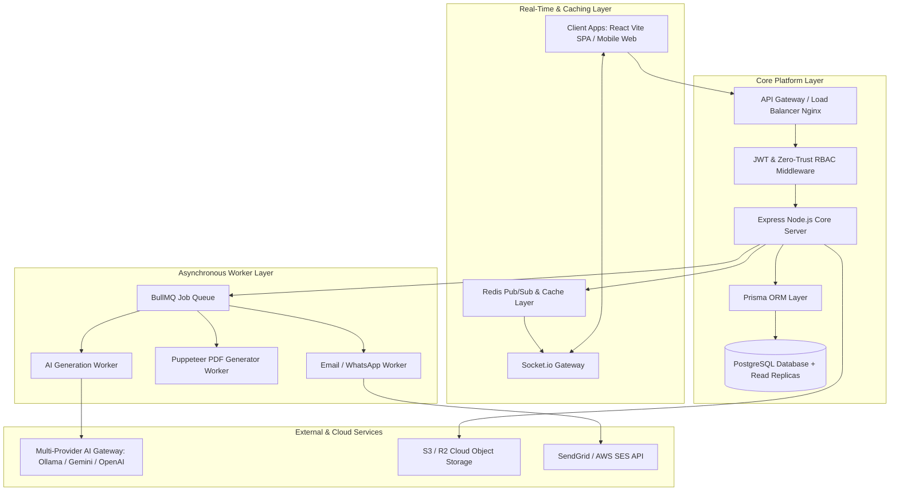
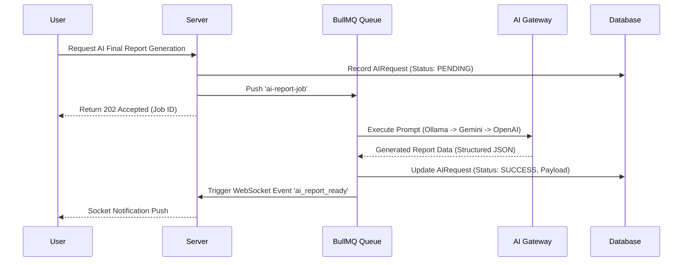

# 01 — System Architecture for Future Enhancements

## 1. High-Level Architecture Overview

The future architecture of the **Eventora Platform** evolves the system into an **Event-Driven, Distributed Micro-Kernel System** built for high throughput, real-time interactivity, and AI capabilities.

---

## 2. Core Architectural Subsystems

### 2.1 Real-Time Streaming & WebSocket Subsystem
- **Technology**: `Socket.io` cluster backed by `Redis` Pub/Sub adapter.
- **Use Cases**:
  - Live Judge Scoring Updates during hackathons.
  - Real-time leaderboard updates for participants.
  - In-app notification delivery without page polling.
  - Live attendee check-in counts on dashboard.

### 2.2 Asynchronous Job Processing Queue
- **Technology**: `BullMQ` running over `Redis`.
- **Worker Queues**:
  1. `pdf-generation-queue`: Converts HTML/React templates into high-resolution PDF certificates and event reports using headless Chrome (`puppeteer`).
  2. `notification-queue`: Dispatches transactional emails (registration confirmations, password resets) and SMS/WhatsApp notifications.
  3. `ai-synthesis-queue`: Handles long-running AI requests (final report generation, rubric generation) asynchronously with webhooks/sockets notifying completion.

### 2.3 Multi-Provider AI Intelligence Gateway
- **Architecture**: A fallback-enabled AI Provider Manager.
- **Fallback Chain**:
  1. Primary: Local **Ollama** (e.g. `llama3` / `mistral`) for privacy-sensitive zero-cost local inference.
  2. Secondary: **Google Gemini API** (`gemini-1.5-flash`) for fast, structured JSON generation.
  3. Tertiary: **OpenAI API** (`gpt-4o-mini`) as high-reliability cloud fallback.

### 2.4 Cloud Media & Asset Pipeline
- **Technology**: AWS S3 or Cloudflare R2 object storage with pre-signed URLs.
- **Flow**:
  1. Frontend requests upload authorization token via `POST /api/v1/storage/presigned-url`.
  2. Backend verifies permissions and returns short-lived pre-signed PUT URL.
  3. Frontend uploads binary directly to cloud storage (bypassing main Node.js server thread).
  4. Object metadata (URL, file key, mime-type) saved in database.

### 2.5 Multi-Tenant Data Isolation Strategy
- All database queries scope automatically via `organizationId` matching tenant header `x-organization-id`.
- Global platform operations (Sudo Admin) bypass tenant filtering using explicit global RBAC guard (`requireGlobalPermission`).

---

## 3. Database & Caching Architecture

### 3.1 Caching Strategy
- **Layer 1 (L1) - In-Memory (Node.js LRU)**: Cache active tenant features and permission maps for 60 seconds.
- **Layer 2 (L2) - Distributed Redis Cache**:
  - `roles:permissions:{orgId}` (TTL: 1 hour, invalidated on role edit).
  - `events:summary:{eventId}` (TTL: 5 minutes, invalidated on registration/submission).

### 3.2 Database Schema Scaling
- **Read Replicas**: Separate read query traffic for heavy analytics & reports from primary write node.
- **Indexes**: Add composite indexes on `(organization_id, status)`, `(event_id, user_id)`, and `(submission_id, judge_id)`.
