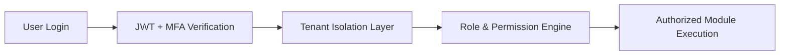
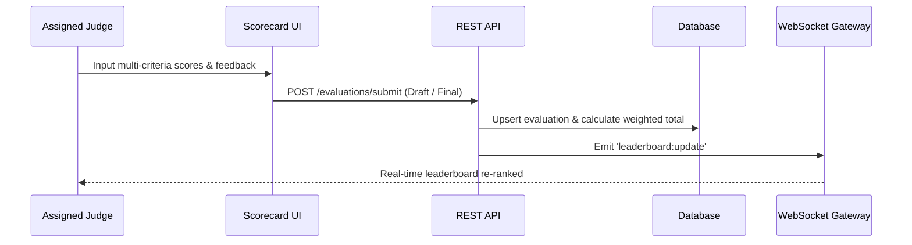

# 02 — Comprehensive Requirements Specification & Acceptance Criteria

> **Document ID:** `SPEC-EVENTORA-REQ-02`  
> **Status:** `APPROVED & BASELINED`  
> **Target Version:** `v2.4.0-Enterprise`  
> **System Scope:** Multi-Tenant Event Lifecycle, Hackathons, Judging Engine, Digital Credentials, AI Dossiers, and Compliance Analytics  

---

## 1. Executive Summary & Purpose

This specification defines the functional, operational, and non-functional requirements for the **Eventora Platform** (powered by Clientura). The platform is an enterprise-grade, multi-tenant operating system designed for educational institutions, developer ecosystems, and enterprises to manage high-stakes hackathons, multi-track competitions, workshops, and symposiums.

### Core User Personas
| Persona | Role Key | Primary Responsibilities |
|:---|:---|:---|
| **Platform / Sudo Admin** | `SUDO_ADMIN` | Global tenant provisioning, system health, platform-wide audit log oversight. |
| **Organization Manager** | `MANAGER` / `ADMIN` | Institutional configuration, role delegation, budget & prize approval, executive report sealing. |
| **Faculty Coordinator** | `FACULTY_COORDINATOR` | Institutional governance, academic compliance review, submission sign-off. |
| **Student Coordinator** | `STUDENT_COORDINATOR` | Operational event execution, attendee logistics, draft generation of final event dossiers. |
| **Judge** | `JUDGE` | Rubric scoring, qualitative feedback, submission recommendations, criteria scorecards. |
| **Mentor** | `MENTOR` | Team office hours, technical guidance, submission review, advisory support. |
| **Volunteer** | `VOLUNTEER` | QR code attendance scanning, check-in validation, venue operations. |
| **Participant / Hacker** | `PARTICIPANT` | Team formation, project submission, certificate claiming, live leaderboard tracking. |

---

## 2. Functional Requirements (FR)

### Domain 1: Multi-Tenancy, Authentication & RBAC



- **FR-1.1 (Multi-Tenant Isolation)**: The system shall enforce logical tenant isolation across all database queries using `organizationId`. Every API request must pass a verified `x-organization-id` header validated against the user's active organization membership.
- **FR-1.2 (Zero-Trust Authentication)**: The system shall authenticate users via cryptographically signed JWT access tokens (15-minute lifespan) paired with HTTP-only refresh tokens.
- **FR-1.3 (Multi-Factor Authentication - MFA)**: Users shall be able to enable TOTP-based two-factor authentication with standard authenticator applications (Google Authenticator, Authy), backed by hashed recovery emergency codes.
- **FR-1.4 (Granular Role-Based Access Control - RBAC)**: Organization Admins shall create custom roles with arbitrary combinations of permissions across 10 distinct modules (`events.*`, `competitions.*`, `submissions.*`, `evaluations.*`, `certificates.*`, `attendance.*`, `communications.*`, `reports.*`, `roles.*`, `ai_copilot.*`).
- **FR-1.5 (Dynamic Permission Enforcement)**: The backend shall reject unauthorized endpoints with `403 FORBIDDEN` via `requirePermission` and `requireAnyPermission` middleware before service layer execution.

---

### Domain 2: Event & Multi-Track Competition Engine

- **FR-2.1 (Lifecycle State Machine)**: Events shall follow a deterministic lifecycle: `DRAFT` ➔ `PUBLISHED` ➔ `REGISTRATION_OPEN` ➔ `ONGOING` ➔ `EVALUATION` ➔ `COMPLETED` ➔ `ARCHIVED`.
- **FR-2.2 (Multi-Track Competitions)**: A single event shall support multiple parallel competition tracks (e.g., "AI Track", "Fintech Track"), each with independent rules, judging panels, capacity limits, and prize pools.
- **FR-2.3 (Problem Statement Repository)**: Coordinators shall attach multiple problem statements to competitions, including challenge briefs, technical constraints, sample datasets, and downloadable starter kits.
- **FR-2.4 (Registration Configuration)**: Event managers shall configure flexible registration parameters, including individual or team registration, min/max team sizing (e.g., 2–5 members), application cutoff dates, and custom onboarding forms.

---

### Domain 3: Team Formation, Project Submissions & Artifacts

- **FR-3.1 (Team Roster & Invitations)**: Participants shall create teams, generate cryptographically signed invitation tokens, invite teammates via email/link, and transfer team leadership.
- **FR-3.2 (Team Locking)**: When registration closes or when the team submits their project, team rosters shall automatically lock to prevent unauthorized mid-hackathon member changes.
- **FR-3.3 (Multi-Artifact Project Submissions)**: Teams shall submit comprehensive project dossiers including:
  - Project Title, Description, and Problem Statement alignment.
  - Public Source Code Repository URL (e.g., GitHub, GitLab).
  - Live Demo / Video Pitch URL.
  - Uploaded design documents, architectural diagrams, and presentation slide decks.
- **FR-3.4 (Multi-Round Submission Stages)**: The system shall support multi-stage hackathons (e.g., Round 1: Ideation Review ➔ Round 2: Prototype Evaluation ➔ Round 3: Final Pitch).

---

### Domain 4: Advanced Hackathon Evaluation & Live Judging Matrix



- **FR-4.1 (Custom Rubric Scoring)**: Admins shall define multi-criteria scoring rubrics per track with custom weightings (e.g., Innovation 30%, Technical Depth 40%, Usability 20%, Presentation 10%).
- **FR-4.2 (Judge Assignment Matrix)**: Managers shall assign judges to specific competitions or submission batches to balance workload and prevent conflict of interest.
- **FR-4.3 (Mobile Scorecard & Draft Persistence)**: Judges shall score submissions via an optimized mobile/desktop scorecard with automatic draft saving and qualitative feedback inputs.
- **FR-4.4 (Scorecard Locking & Immutability)**: Once a judge marks an evaluation as finalized, it shall lock immediately. Changes shall require an explicit administrative unlock with an audited reason.
- **FR-4.5 (Score Normalization & Bias Reduction)**: The platform shall compute standardized Z-scores across judge panels to eliminate individual grading discrepancies (strict vs. lenient evaluators).

---

### Domain 5: Results Ledger, Podium Allocations & Prize Management

- **FR-5.1 (Automated Rankings)**: The system shall automatically aggregate weighted rubric scores to generate provisional track rankings and composite leaderboards.
- **FR-5.2 (Podium & Prize Assignment)**: Managers shall allocate official podium standings (1st, 2nd, 3rd, Honorable Mention) and bind them to monetary or sponsored prizes.
- **FR-5.3 (Disbursement & Settlement Tracking)**: The platform shall track prize disbursement lifecycle statuses (`PENDING`, `PROCESSING`, `DISBURSED`, `VOID`).
- **FR-5.4 (Public Results Release)**: Results shall remain sequestered until the Organization Manager officially executes the "Publish Results" action.

---

### Domain 6: AI Final Event Reports & Executive Dossiers

- **FR-6.1 (Multi-Tier Review Pipeline)**: Every completed event shall mandate a formal final dossier workflow:
  1. **Draft Stage**: Student Coordinator initiates statistics aggregation and triggers AI synthesis.
  2. **Faculty Review Stage**: Faculty Coordinator reviews expenditure, academic compliance, and adds feedback.
  3. **Manager Seal Stage**: Organization Manager performs final sign-off, sealing the dossier.
- **FR-6.2 (Gemini / AI Copilot Synthesis)**: The AI engine shall ingest verified metrics (registrations, track counts, attendance rate, winning submissions) and synthesize:
  - Executive Overview
  - Quantitative Event Outcomes
  - Key Technical Highlights
  - Operational Challenges & Mitigations
  - Strategic Recommendations for Future Editions
- **FR-6.3 (Official Sealed PDF Generation)**: The system shall generate an official, print-ready, high-resolution PDF dossier featuring institutional branding, coordinator signatures, verification stamps, and metadata.

---

### Domain 7: Cryptographic Digital Certificates & Verification

- **FR-7.1 (Certificate Archetypes)**: The system shall issue distinct certificate types (`PARTICIPATION`, `WINNER`, `RUNNER_UP`, `MERIT`, `VOLUNTEER`, `MENTOR`, `JUDGE`).
- **FR-7.2 (Dynamic Template Binding)**: Certificate generation shall dynamically interpolate recipient details:
  - Recipient Full Name & Email
  - Event & Competition Track
  - Award Rank / Category
  - Issue Date & Unique Serial Certificate Number
- **FR-7.3 (Public QR Verification)**: Every issued certificate shall encode a public verification URL with an immutable cryptographic verification hash:
  ```
  https://eventora.edu/certificates/verify/:verificationCode
  ```
- **FR-7.4 (Revocation & Status Auditing)**: Managers shall have authority to revoke or reissue credentials, updating the public verification page in real time with status badges (`ISSUED`, `REVOKED`, `EXPIRED`).

---

### Domain 8: Attendance Tracking & Real-Time QR Check-In

- **FR-8.1 (Attendance Sessions)**: Coordinators shall create scheduled attendance check-in sessions per event (e.g., "Day 1 Morning Check-In", "Dinner Gate Scan", "Final Demo Check-In").
- **FR-8.2 (Cryptographic QR Badges)**: Participants shall present an in-app encrypted QR code badge encoding their user ID, event ID, and issue timestamp.
- **FR-8.3 (Volunteer Scanner Interface)**: Authorized volunteers shall scan participant badges using standard mobile device cameras, receiving instant haptic and visual confirmation of check-in status.
- **FR-8.4 (Offline Check-In Reconciliation)**: In intermittent network conditions, the volunteer scanner shall cache scans locally and synchronize with the backend once connectivity resumes.

---

### Domain 9: Multi-Channel Communications & Broadcast Engine

- **FR-9.1 (Targeted Broadcasts)**: Event managers shall dispatch broadcast messages filtered by precise audience segments (`ALL`, `REGISTERED_PARTICIPANTS`, `TEAM_LEADS`, `JUDGES`, `MENTORS`, `VOLUNTEERS`).
- **FR-9.2 (Multi-Channel Delivery)**: Communications shall dispatch across:
  - Real-time in-app notification center.
  - Transactional email delivery (SendGrid / AWS SES).
  - Webhook triggers for institutional Slack/Discord channels.
- **FR-9.3 (Delivery Auditing)**: Every broadcast record shall track sender, recipient count, audience filter, scheduled timestamp, and publication status.

---

### Domain 10: Operational Master CSV Datasets & Auditing

- **FR-10.1 (8 Master Operational Datasets)**: Organization managers shall have one-click CSV export access across 8 institutional datasets:
  1. `events`: Timelines, status, registration counts, track counts.
  2. `competitions`: Tracks, team counts, submission counts, judge assignments, winners.
  3. `participants`: Master participant roster, contact emails, status, registration timestamps.
  4. `evaluations`: Comprehensive judge scorecards, multi-criteria scores, qualitative feedback.
  5. `attendance`: Check-in logs, session names, participant IDs, verification timestamps.
  6. `certificates`: Issued credentials ledger, serial numbers, recipient verification codes.
  7. `winners`: Official podium ledger, track allocations, cash prize valuations.
  8. `communications`: Broadcast history, audience filters, dispatch timestamps, authors.
- **FR-10.2 (Audit Trail Logging)**: Every sensitive administrative action (exports, role updates, report approvals, prize allocations) shall write an immutable record into the `AuditLog` table capturing `actorId`, `organizationId`, `action`, `target`, `ipAddress`, and `metadata`.

---

## 3. Non-Functional Requirements (NFR)

### NFR-1: Performance & Latency SLAs
- **API Response Time**: P95 latency $\le 150\text{ ms}$ for read endpoints; P99 latency $\le 300\text{ ms}$ for transactional writes under nominal load (1,000 req/sec).
- **Live Leaderboard Latency**: WebSocket score recalculation and fan-out delivery across connected clients shall occur in $\le 100\text{ ms}$.
- **Export Throughput**: Generation of CSV datasets containing $\le 10,000$ rows shall complete in $\le 1.5\text{ seconds}$.
- **PDF Generation**: High-resolution vector PDF dossiers and certificates shall compile in $\le 3\text{ seconds}$ per document.

### NFR-2: Security, Governance & Zero-Trust
- **Token Cryptography**: Access tokens signed via HMAC SHA-256 with key rotation support.
- **Password Hashing**: Passwords stored using `bcrypt` with work factor $\ge 10$.
- **Database Sanitization**: 100% parameterization via Prisma ORM preventing SQL injection.
- **Content Security & XSS**: Strict sanitization of markdown inputs and output encoding.
- **Network Rate Limiting**: Global rate limit of 100 requests/minute per IP address for standard endpoints, and 5 requests/minute for sensitive auth endpoints (`/login`, `/register`).

### NFR-3: Scalability, Availability & Reliability
- **Concurrent Capacity**: Backend cluster shall support $\ge 5,000$ concurrent active WebSocket sessions during live event judgment rounds.
- **Uptime Target**: $99.9\%$ monthly service availability excluding scheduled maintenance windows.
- **Database Connection Pooling**: Prisma connection pool dynamically tuned with resilient retry mechanics for connection timeouts.
- **Graceful Degradation**: If third-party AI APIs (Gemini) experience throttling, the system shall queue requests or fail over without compromising core event scoring.

### NFR-4: Accessibility & Cross-Platform Usability
- **Design System Standards**: Compliant with WCAG 2.1 Level AA contrast ratios and keyboard navigation standards.
- **Responsive Layout**: Fluid experience across mobile viewports (360px+), tablet, and ultra-wide desktop monitors (up to 4K).
- **Aesthetic Excellence**: High-contrast, executive dark slate design language devoid of distracting gradients or neon badges.

---

## 4. User Stories & Acceptance Criteria

### User Story US-1: Custom Role Delegation & Granular Permissions
> **As an** Organization Manager  
> **I want to** create a custom role with scoped permissions (e.g. `reports.read`, `reports.export`)  
> **So that** department staff can download audit datasets without accessing financial or user management settings.

```gherkin
Scenario: Organization Manager successfully creates a scoped Auditor role
  Given an authenticated Organization Manager in organization "Acme University"
  When the manager navigates to the Role Management console at "/manager/roles"
  And clicks "Create Role"
  And specifies role name "Compliance Auditor"
  And checks permissions "reports.read" and "reports.export"
  And submits the form
  Then the system persists the role in the database
  And assigns organizationId "Acme University"
  And immediately renders "Compliance Auditor" in member assignment dropdowns
  And users assigned this role can access "/manager/reports" but receive 403 on "/manager/settings"
```

---

### User Story US-2: Judge Multi-Criteria Scorecard Submission
> **As an** Assigned Judge  
> **I want to** evaluate a team's hackathon project using an interactive rubric scorecard  
> **So that** my evaluations are accurately factored into the live leaderboard.

```gherkin
Scenario: Judge submits finalized score for a competition project
  Given Judge "Elena Markovic" assigned to "AI for Accessibility Track"
  And team "Team Quantum" has submitted project "SignBridge"
  When Elena opens the scorecard at "/evaluations/score/:submissionId"
  And enters criteria scores: Innovation (28/30), Technical (38/40), Presentation (28/30)
  And inputs qualitative recommendation "Exceptional latency optimization on Edge TPU"
  And clicks "Finalize & Submit Scorecard"
  Then the system computes total score 94.0
  And persists the evaluation with status "COMPLETED"
  And marks isLocked as true
  And triggers WebSocket broadcast updating the track leaderboard
  And Elena cannot edit the scores without administrative unlock
```

---

### User Story US-3: Multi-Tier Event Report Approval Workflow
> **As a** Student Coordinator  
> **I want to** trigger AI synthesis for the completed hackathon dossier and submit it for approvals  
> **So that** the Faculty Coordinator and Organization Manager can formally seal the event.

```gherkin
Scenario: Complete report lifecycle from AI generation to Manager sign-off
  Given a completed event "Global AI Hackathon 2026" with 120 participants and 24 submissions
  When the Student Coordinator clicks "Generate AI Final Report"
  Then the system queries verified event aggregates and invokes Gemini AI
  And populates Executive Summary, Key Highlights, and Recommendations
  When the Student Coordinator reviews the draft and clicks "Submit to Faculty"
  Then the report status transitions to "SUBMITTED_TO_FACULTY"
  When the Faculty Coordinator reviews and clicks "Recommend to Manager"
  Then the report status transitions to "SUBMITTED_TO_MANAGER"
  When the Organization Manager clicks "Sign Off & Seal"
  Then the report status transitions to "APPROVED"
  And the system signs the document with the Manager's ID and timestamp
  And enables official sealed PDF download for all institutional stakeholders
```

---

### User Story US-4: Master Operational CSV Dataset Export
> **As an** Institutional Auditor / Event Manager  
> **I want to** download raw master CSV datasets across all operational modules  
> **So that** I can conduct external audits, accreditation filings, and financial reviews.

```gherkin
Scenario: Manager exports Judge Scorecards master dataset
  Given an authenticated Organization Manager with permission "reports.export"
  When the manager opens the Operational Exports tab at "/manager/reports"
  And clicks "Download CSV" on the "Judge Scorecards" card
  Then the system invokes GET "/api/v1/reports/evaluations/export?format=csv"
  And verifies tenant isolation for the active organization
  And returns HTTP 200 with Content-Type "text/csv"
  And Content-Disposition header "attachment; filename=evaluations-export-YYYY-MM-DD.csv"
  And the CSV contains columns: ID, Competition, Submission, JudgeName, Status, Score
  And writes an entry to AuditLog with action "REPORT_EXPORT"
```

---

### User Story US-5: Public Digital Certificate Verification
> **As an** Employer or Third-Party Verifier  
> **I want to** scan the QR code on a participant's certificate  
> **So that** I can independently verify its authenticity without requiring an account.

```gherkin
Scenario: Public verification of an authentic participation credential
  Given an issued certificate with code "CERT-AI-2026-98124"
  When an external verifier accesses "/certificates/verify/CERT-AI-2026-98124"
  Then the server queries the database by verificationCode
  And returns HTTP 200 with recipient name, event name, award type, and issue date
  And displays a verified green shield badge "Authentic Credential Issued by Eventora"
  And does not expose private contact information (e.g. phone number or password hash)
```

---

## 5. Traceability Matrix

| Requirement ID | Module / Subsystem | Database Model(s) | Primary User Role | Status |
|:---|:---|:---|:---|:---:|
| **FR-1.1 – FR-1.5** | Multi-Tenancy & RBAC | `Organization`, `User`, `Role`, `Permission` | Admin / Manager | ✅ **Verified** |
| **FR-2.1 – FR-2.4** | Event & Track Lifecycle | `Event`, `Competition`, `ProblemStatement` | Manager / Coordinator | ✅ **Verified** |
| **FR-3.1 – FR-3.4** | Teams & Submissions | `Team`, `TeamMember`, `Submission` | Participant | ✅ **Verified** |
| **FR-4.1 – FR-4.5** | Judging & Rubrics | `Judge`, `Evaluation`, `EventRound` | Judge / Coordinator | ✅ **Verified** |
| **FR-5.1 – FR-5.4** | Podium & Prizes | `Winner`, `Prize`, `Competition` | Manager | ✅ **Verified** |
| **FR-6.1 – FR-6.3** | AI Reports & Dossiers | `EventFinalReport`, `Event`, `User` | Coordinator / Manager | ✅ **Verified** |
| **FR-7.1 – FR-7.4** | Digital Certificates | `Certificate`, `User`, `Event` | Public / Participant | ✅ **Verified** |
| **FR-8.1 – FR-8.4** | QR Attendance System | `AttendanceSession`, `AttendanceRecord` | Volunteer / Participant | ✅ **Verified** |
| **FR-9.1 – FR-9.3** | Broadcast Messaging | `Communication`, `Notification` | Manager / Coordinator | ✅ **Verified** |
| **FR-10.1 – FR-10.2**| CSV Exports & Auditing | `AuditLog`, `ReportsRepository` | Manager / Auditor | ✅ **Verified** |

---

> **Document Approval:**  
> Lead Architect: *Antigravity Core Engineering*  
> Institutional Lead: *Clientura Platform Engineering*  
> Date of Last Audit: *October 2026*
