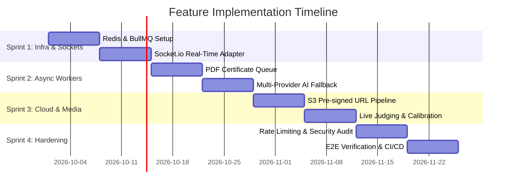

# 03 — Implementation Plan & Code Patterns

## Implementation Roadmap (Sprints 1 - 4)



---

## 1. Reference Implementation Patterns

### 1.1 BullMQ Job Queue Setup (`server/src/queues/certificate.queue.ts`)

```typescript
import { Queue, Worker } from 'bullmq';
import { redisConfig } from '../config/redis';
import { generateCertificatePdf } from '../services/pdf.service';

export const certificateQueue = new Queue('certificate-generation', { connection: redisConfig });

export const certificateWorker = new Worker(
  'certificate-generation',
  async (job) => {
    const { certificateId, userId, templateId } = job.data;
    console.log(`Processing certificate ${certificateId} for user ${userId}`);
    
    const pdfBuffer = await generateCertificatePdf({ certificateId, userId, templateId });
    // Upload to S3 and update DB record status to 'ISSUED'
    return { status: 'SUCCESS', certificateId };
  },
  { connection: redisConfig }
);
```

### 1.2 Multi-Provider AI Fallback Gateway (`server/src/services/ai-gateway.service.ts`)

```typescript
import fetch from 'node-fetch';

export class AIGatewayService {
  static async generateText(prompt: string): Promise<string> {
    // 1. Try Local Ollama First
    try {
      const ollamaRes = await fetch('http://localhost:11434/api/generate', {
        method: 'POST',
        headers: { 'Content-Type': 'application/json' },
        body: JSON.stringify({ model: 'llama3', prompt, stream: false }),
      });
      if (ollamaRes.ok) {
        const data: any = await ollamaRes.json();
        return data.response;
      }
    } catch (e) {
      console.warn('Ollama unavailable, falling back to Gemini API...');
    }

    // 2. Fallback to Google Gemini API
    try {
      const geminiApiKey = process.env.GEMINI_API_KEY;
      if (geminiApiKey) {
        const geminiRes = await fetch(
          `https://generativelanguage.googleapis.com/v1beta/models/gemini-1.5-flash:generateContent?key=${geminiApiKey}`,
          {
            method: 'POST',
            headers: { 'Content-Type': 'application/json' },
            body: JSON.stringify({ contents: [{ parts: [{ text: prompt }] }] }),
          }
        );
        if (geminiRes.ok) {
          const data: any = await geminiRes.json();
          return data.candidates[0].content.parts[0].text;
        }
      }
    } catch (e) {
      console.warn('Gemini unavailable, falling back to OpenAI...');
    }

    // 3. Fallback to OpenAI API
    const openaiApiKey = process.env.OPENAI_API_KEY;
    const openaiRes = await fetch('https://api.openai.com/v1/chat/completions', {
      method: 'POST',
      headers: {
        'Content-Type': 'application/json',
        Authorization: `Bearer ${openaiApiKey}`,
      },
      body: JSON.stringify({
        model: 'gpt-4o-mini',
        messages: [{ role: 'user', content: prompt }],
      }),
    });
    const data: any = await openaiRes.json();
    return data.choices[0].message.content;
  }
}
```

### 1.3 Socket.io Real-Time Room Broadcasting (`server/src/sockets/events.socket.ts`)

```typescript
import { Server, Socket } from 'socket.io';

export function registerEventSockets(io: Server) {
  io.on('connection', (socket: Socket) => {
    socket.on('join_event_room', (eventId: string) => {
      socket.join(`event:${eventId}`);
      console.log(`Socket ${socket.id} joined room event:${eventId}`);
    });

    socket.on('submit_score', (data: { eventId: string; submissionId: string; score: number }) => {
      // Broadcast updated score to all judges and managers in the room
      io.to(`event:${data.eventId}`).emit('score_updated', data);
    });
  });
}
```

---

## 2. Database Migration Scripts

```sql
-- Create Enum for AI Request Status
CREATE TYPE "AIRequestStatus" AS ENUM ('PENDING', 'PROCESSING', 'SUCCESS', 'FAILED');

-- Create AI Requests Log Table
CREATE TABLE "ai_requests" (
    "id" TEXT NOT NULL PRIMARY KEY,
    "organization_id" TEXT NOT NULL,
    "feature" TEXT NOT NULL,
    "prompt" TEXT NOT NULL,
    "payload" JSONB,
    "tokens" INTEGER NOT NULL DEFAULT 0,
    "duration_ms" INTEGER NOT NULL DEFAULT 0,
    "status" "AIRequestStatus" NOT NULL DEFAULT 'PENDING',
    "requested_by_id" TEXT NOT NULL,
    "created_at" TIMESTAMP(3) NOT NULL DEFAULT CURRENT_TIMESTAMP,
    CONSTRAINT "ai_requests_organization_id_fkey" FOREIGN KEY ("organization_id") REFERENCES "organizations"("id") ON DELETE CASCADE,
    CONSTRAINT "ai_requests_requested_by_id_fkey" FOREIGN KEY ("requested_by_id") REFERENCES "users"("id") ON DELETE CASCADE
);

-- Index for real-time aggregation queries
CREATE INDEX "ai_requests_org_status_idx" ON "ai_requests"("organization_id", "status");
```

---

## 3. Verification & Testing Strategy

### Automated API Tests
- `npm run test:rbac`: Validates route protection and permissions across `Sudo Admin`, `Admin`, `Student Coordinator`, `Faculty Coordinator`, and `Participant`.
- `npm run test:e2e`: Runs complete end-to-end event flow: Proposal creation -> Manager Review -> Principal Approval -> Event Creation -> Final Report.

### Build & Type Verification
- `npx tsc --noEmit` (Frontend & Backend)
- `npm run build`
